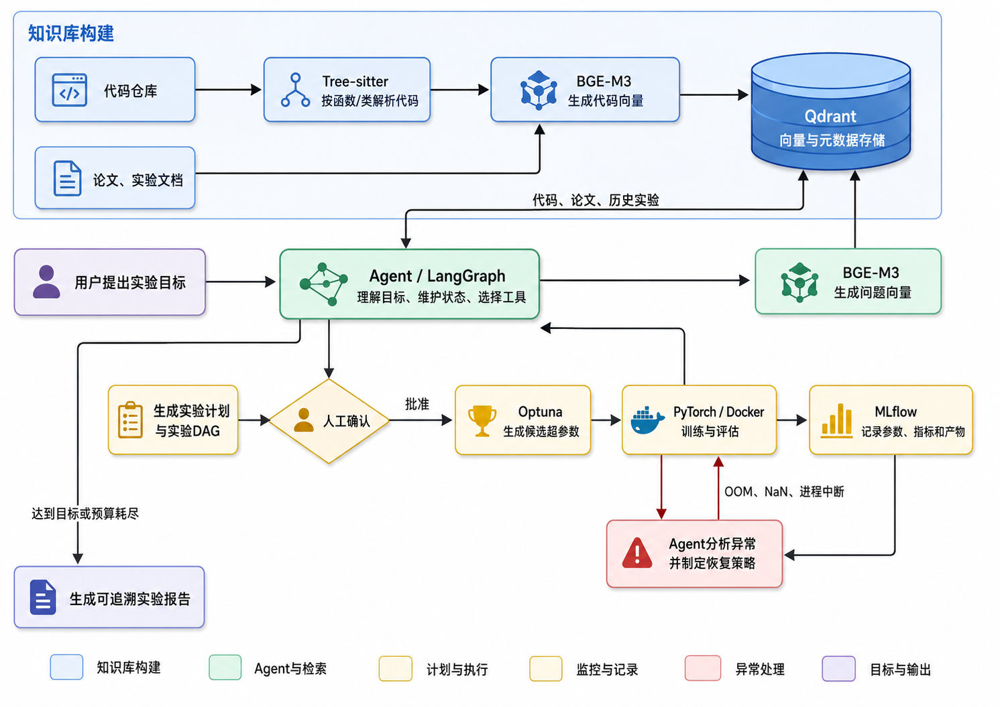
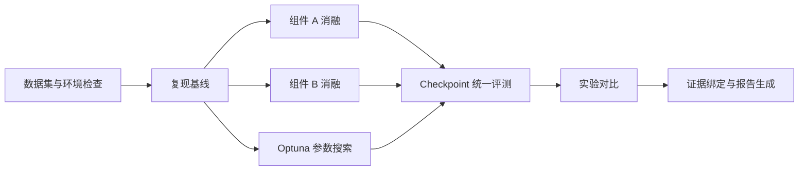

<div align="center">

# VisionLab-Agent

**面向可复现深度学习研究的科研实验 Agent**

将实验目标转化为经过检索、校验与审批的执行计划，并在受控环境中完成训练、监控、恢复和结果复盘。


[项目概览](#项目概览) · [系统流程](#系统流程) · [核心能力](#核心能力) · [技术架构](#技术架构) · [异常恢复](#异常恢复) · [实验结果](#实验结果)

</div>

> [!NOTE]
> 当前公开仓库以项目说明和架构展示为主。现有提交尚未包含源码、依赖文件、训练配置、Docker 编排文件、MLflow 导出或评测脚本，因此下文不提供未经验证的安装与运行命令。文中的实现细节和实验结果来自项目说明；可执行复现材料公开后，应以对应版本的代码和实验记录为准。

## 项目概览

VisionLab-Agent 面向深度学习研究中常见的实验配置重复、训练任务管理分散、异常排查耗时以及结果难以追溯等问题，构建一个覆盖实验完整生命周期的有状态科研实验 Agent。

系统以 **TopoSSM 裂缝分割**为真实工作负载，面向 **Crack500**、**DeepCrack** 等公开数据集，支持基线复现、组件消融、参数搜索、训练监控、故障恢复、Checkpoint 评测、实验对比和结果报告。它不替代研究者做最终判断，而是把重复、易错且需要留痕的实验操作组织成一个可审核的执行闭环。

> **核心主线：** 实验目标 → 证据检索 → 实验 DAG → Schema 校验 → 人工审批 → 受控训练 → 监控诊断 → 有界恢复 → 可追溯报告

### 要解决的问题

| 研究痛点 | VisionLab-Agent 的处理方式 | 关键产物 |
| --- | --- | --- |
| 配置复制频繁，变量容易失控 | 用结构化 Schema 描述目标、基线、变量、依赖和终止条件 | 已解析配置、变量清单、校验结果 |
| 代码、论文和历史实验相互割裂 | 对代码、配置、论文说明和历史 Run 进行混合检索 | 带来源定位的证据集合 |
| 多组训练依赖人工编排 | 将基线、消融和搜索任务编译为有依赖关系的实验 DAG | 可审批、可恢复的执行计划 |
| GPU 使用缺少统一约束 | 在候选生成和执行前检查 GPU 时间预算与任务上限 | 成本估算、预算消耗记录 |
| OOM、NaN 和中断排查耗时 | 从日志、指标和 Checkpoint 中识别故障并应用受限恢复策略 | 诊断结论、恢复动作、重试记录 |
| 指标与代码版本难以对应 | 用 Git Commit、配置版本、数据版本和 MLflow Run ID 串联证据 | 可复现、可验证、可审计的报告 |

## 系统流程

<p align="center">
  
</p>

<p align="center"><sub>VisionLab-Agent 总体架构与实验闭环。图片使用仓库相对路径，可在 GitHub 页面直接显示。</sub></p>

流程图由五类职责区域组成：

- **知识库构建（蓝色）**：解析代码、配置、论文说明和历史实验，将向量及可追溯元数据写入 Qdrant。
- **Agent 与检索（绿色）**：LangGraph 负责理解目标、维护状态和选择工具；BGE-M3 生成查询向量并召回相关证据。
- **计划与执行（黄色）**：生成实验计划与 DAG，经人工审批后，由 Optuna、PyTorch 和 Docker 完成候选生成、训练与评测。
- **监控与记录（橙色）**：MLflow 记录参数、指标、代码版本和输出产物，为诊断与报告提供事实来源。
- **异常与输出（红色 / 紫色）**：识别 OOM、NaN、进程中断等异常并执行受限恢复；达到目标或耗尽预算后生成实验报告。

## 核心能力

| 能力 | 机制 | 预期输出 |
| --- | --- | --- |
| 基线复现 | 固定代码、配置、数据和运行环境后重建基线任务 | Baseline Run、Checkpoint、指标与环境记录 |
| 组件消融 | 将每个实验假设转换为单变量或受控变量分支 | 消融 DAG、变量差异、横向对比表 |
| 参数搜索 | Agent 生成搜索计划，Optuna 在预定义空间和 GPU 预算内选择候选 | Trial 列表、最优配置、搜索轨迹 |
| 训练监控 | 持续读取训练日志、资源状态、关键指标和产物 | 运行状态、异常信号、预算消耗 |
| 受限恢复 | 基于故障类型、尝试次数和审批状态选择白名单动作 | 恢复决策、新 Run 或续训 Run、审计日志 |
| 结果复盘 | 关联实验假设、配置、数据、代码、Run 和日志证据 | 可追溯实验报告与结论依据 |

## 端到端工作流

| 阶段 | 输入 | 关键处理 | 状态或产物 |
| --- | --- | --- | --- |
| 1. 目标解析 | 自然语言实验目标 | 提取任务类型、数据集、基线、变量、指标、预算和终止条件 | 结构化 `ExperimentGoal` |
| 2. 资料检索 | 目标、当前代码版本 | 检索代码符号、配置、论文依据和相似历史实验 | 带引用的证据集合 |
| 3. DAG 生成 | 目标与检索证据 | 编排数据检查、基线、消融、搜索、评测和报告依赖 | `ExperimentDAG` |
| 4. 计划校验 | DAG、资源约束、工具权限 | 执行 Schema、依赖、配置和 GPU 成本校验 | 校验结果与成本估算 |
| 5. 人工审批 | 计划摘要、配置差异、预算 | 审核实验范围、高风险动作和代码修改 | 审批状态与审核意见 |
| 6. 训练执行 | 已批准计划 | 通过受控工具在 Docker 环境中启动 PyTorch 训练 | MLflow Run、日志、Checkpoint |
| 7. 监控诊断 | 日志、指标、资源状态 | 识别 OOM、NaN、中断、配置错误等异常 | 故障类型与诊断证据 |
| 8. 恢复或终止 | 诊断结果、重试次数、剩余预算 | 降低 Batch Size、Checkpoint 续训、停止或请求重新审批 | 更新后的 DAG 和运行状态 |
| 9. 结果报告 | 所有 Run、配置、指标和日志 | 对齐假设与证据，比较实验并生成结论 | 可追溯实验报告 |

### 典型实验 DAG



每个节点都应声明输入、依赖、GPU 预算、最大尝试次数、成功条件和失败策略。只有依赖满足且审批状态有效的节点才能进入执行队列。

## 技术架构

| 层次 | 组件 | 职责 |
| --- | --- | --- |
| 工作流编排 | LangGraph | 维护实验状态，驱动规划、审批、执行、恢复和报告节点 |
| 数据建模 | Pydantic | 定义目标、配置、依赖、GPU 预算、审批状态和终止条件 |
| 代码理解 | Tree-sitter | 按函数、类和训练入口切分代码，保留符号与文件边界 |
| 混合检索 | BM25 + BGE-M3 | 结合关键词匹配与语义召回，覆盖代码、配置、论文和历史实验 |
| 向量存储 | Qdrant | 保存向量、文本片段和版本化元数据，并支持过滤检索 |
| 参数搜索 | Optuna | 在预先定义的参数空间、Trial 上限和 GPU 预算内搜索 |
| 训练评测 | PyTorch + Docker | 在隔离环境中执行 TopoSSM 训练、续训与 Checkpoint 评测 |
| 实验追踪 | MLflow | 记录代码版本、超参数、指标、日志、模型和输出文件 |

### 计划 Schema（逻辑示意）

下面的 YAML 用于解释一份实验计划需要表达的信息，并不对应当前仓库中可直接执行的配置文件。

```yaml
experiment:
  id: "topossm-crack500-ablation"
  objective: "验证目标组件对裂缝分割效果的影响"
  type: "ablation"                  # baseline | ablation | search

workload:
  project: "TopoSSM"
  task: "crack-segmentation"
  dataset: "Crack500"
  data_version: "<dataset-manifest-or-checksum>"

baseline:
  git_commit: "<immutable-commit-sha>"
  config_version: "<baseline-config-version>"
  checkpoint: "<optional-checkpoint-uri>"

changes:
  - field: "<component-or-parameter>"
    from: "<baseline-value>"
    to: "<candidate-value>"

resources:
  gpu_type: "<approved-gpu-type>"
  gpu_count: 1
  max_gpu_hours: 24
  max_trials: 20

termination:
  primary_metric: "<metric-name>"
  target: "<target-value>"
  max_retries: 2

approval:
  required: true
  status: "pending"                 # pending | approved | rejected
```

### 工作流状态

LangGraph Checkpoint 用于跨节点保存和恢复实验上下文。核心状态应至少包含：

| 状态字段 | 说明 |
| --- | --- |
| `goal` | 已解析的研究目标、指标和边界条件 |
| `evidence` | 代码、配置、论文与历史实验的检索证据 |
| `dag` | 实验节点、依赖关系和节点执行状态 |
| `approval_status` | 当前计划及高风险动作的审批结果 |
| `run_ids` | DAG 节点与 MLflow Run ID 的映射 |
| `checkpoints` | 可用于评测或恢复的 Checkpoint 路径 |
| `attempts` | 节点尝试次数、失败类型与恢复动作 |
| `budget` | GPU 时间上限、已用预算和剩余预算 |
| `termination` | 目标达成、预算耗尽和异常终止条件 |

这种状态设计使工作流可以从最后一个已确认节点继续，而不是在 Agent 或训练进程中断后重新规划全部实验。

## 代码与实验 RAG

### 索引链路

1. **来源归一化**：接入 Python 代码、训练配置、论文说明、实验文档和历史 MLflow 记录。
2. **结构化切分**：使用 Tree-sitter 定位函数、类、训练入口及其文件范围，避免按固定长度截断关键上下文。
3. **双路召回**：BM25 处理符号名、参数名和精确关键词；BGE-M3 处理自然语言目标与语义相似内容。
4. **向量与元数据存储**：将嵌入、文本片段和版本字段写入 Qdrant。
5. **融合与过滤**：按任务类型融合稀疏和稠密结果，并通过代码版本、配置版本或 Run ID 过滤过期证据。
6. **引用封装**：将最终证据连同来源定位交给计划节点，报告只引用可回溯内容。

### 证据溯源字段

| 字段 | 用途 |
| --- | --- |
| 文件路径 | 定位代码或配置来源 |
| Git Commit | 固定检索结果对应的代码快照 |
| 代码符号 | 定位函数、类或训练入口 |
| 配置版本 | 区分同名配置在不同实验中的变化 |
| 数据版本 | 固定数据来源、划分和预处理版本 |
| MLflow Run ID | 连接历史参数、指标、日志和产物 |

检索结果只有在版本字段与当前实验约束一致时才可作为执行依据；否则应被标记为历史参考，而不是直接复用。

## 工具调用与执行边界

Agent 只负责生成候选计划、维护状态和调用经过注册的工具，不直接执行任意 Shell 命令。工具按权限划分为：

| 工具类别 | 示例 | 约束 | 审计记录 |
| --- | --- | --- | --- |
| 只读检查 | 代码检索、数据集检查、日志读取、实验查询 | 不修改代码、配置或运行状态 | 查询条件、结果引用、时间戳 |
| 计划校验 | Schema 校验、依赖检查、GPU 成本估算 | 校验失败时禁止进入执行节点 | 错误字段、预算估算、校验版本 |
| 受控执行 | 训练启动、Checkpoint 评测、允许范围内续训 | 固定命令模板、参数白名单和 Docker 环境 | 实际参数、镜像、Run ID、退出状态 |
| 结果处理 | 实验对比、指标汇总、报告生成 | 只读取已登记的实验产物 | Run 列表、指标来源、报告版本 |
| 人工审批 | 代码修改、计划变更、预算扩展、越界恢复 | 未批准时保持暂停，不自动绕过 | 审批人、意见、时间和计划摘要 |

## 异常恢复

恢复动作必须满足四个条件：**策略已登记、尝试次数未超限、预算仍充足、动作权限已获批准**。

| 故障 | 诊断证据 | 允许的受限策略 | 终止 / 升级条件 |
| --- | --- | --- | --- |
| GPU OOM | 退出码、CUDA 日志、显存峰值 | 在批准下限内降低 Batch Size 后重试 | 连续失败、预算不足或配置越界 |
| NaN / Inf | Loss、梯度或指标中的非有限值 | 停止当前 Run，保存诊断上下文并按已批准策略重新执行 | 原因不明或重试后再次出现 |
| 训练进程中断 | 心跳丢失、非正常退出、最后 Checkpoint | 从已验证 Checkpoint 续训并创建关联 Run | Checkpoint 损坏或状态不一致 |
| 配置错误 | Pydantic 错误、参数冲突、缺少依赖 | 在训练前阻断，返回配置修订或重新审批 | 修改影响实验假设或执行边界 |

项目说明中覆盖 7 类故障；当前公开材料只明确列出了上述代表性类型。完整故障分类、样本数量和恢复判定规则应随评测脚本一并公开。

## 安全与可追溯性

| 控制点 | 规则 | 降低的风险 |
| --- | --- | --- |
| 环境隔离 | 训练在固定 Docker 镜像中运行 | 依赖漂移和宿主环境污染 |
| 代码固定 | 每个实验绑定不可变 Git Commit | 使用错误或已更新代码复现实验 |
| 命令白名单 | 只允许注册工具调用固定模板 | 任意命令执行和参数注入 |
| 资源预算 | 限制 GPU 类型、数量、时长和 Trial 数 | 无界参数搜索和资源失控 |
| 审批门 | 计划、代码修改和越界恢复需要人工确认 | Agent 擅自扩大实验范围 |
| 全链路记录 | 关联配置、数据、Run、日志和产物 | 结论缺少证据或无法审计 |

一份可复现实验报告应至少绑定以下内容：

- 研究假设与成功标准；
- Git Commit、Docker 镜像摘要和完整解析后配置；
- 数据来源、许可、校验和、划分及预处理版本；
- 随机种子、硬件信息和 GPU 时间消耗；
- MLflow Run ID、关键指标、日志与 Checkpoint 校验和；
- 所有自动恢复动作、人工审批记录和失败实验；
- 对比结论及其直接证据。

## 工作负载与实验类型

### TopoSSM 裂缝分割

TopoSSM 用作端到端真实工作负载，覆盖从数据检查、基线复现到多组实验比较的完整链路。当前项目说明涉及：

- **Crack500**：用于裂缝分割训练与评测的公开数据集；
- **DeepCrack**：用于跨数据集或补充实验的公开裂缝数据集；
- **基线实验**：验证环境、代码、配置和数据版本能否得到稳定结果；
- **组件消融**：控制其他变量不变，评估目标模块对结果的影响；
- **参数实验**：由 Optuna 在固定空间与预算内生成 Trial；
- **统一评测**：对 Checkpoint 使用一致的评测配置，并将结果写回 MLflow。

> 数据集不应直接提交到 Git 仓库。正式复现版本应提供数据来源、使用许可、目录规范、划分文件和校验和清单。

## 实验结果

以下为项目说明中报告的内部结果。当前提交尚未包含原始 Run、评测脚本或报告，因此这些数值应视为**待公开材料验证的项目方结果**。

| 维度 | 已报告结果 | 当前需要补充的复现信息 |
| --- | ---: | --- |
| 端到端任务完成率 | **85%** | 4 个冻结实验任务的运行次数、成功判定和统计分母 |
| 代码与配置检索 | **Recall@5 90%** | 查询集规模、相关性标注和检索配置 |
| 检索排序质量 | **nDCG@10 0.80** | 相关性等级与计算脚本 |
| 引用正确率 | **100%** | 引用正确的定义、样本数和人工复核协议 |
| 故障识别率 | **90%** | 7 类故障的分布、注入方式和混淆矩阵 |
| 可恢复故障恢复成功率 | **85%** | 可恢复范围、最大重试次数和成功标准 |
| 自动实验规模 | **20 组** | 基线、消融和参数实验的构成及配置清单 |
| 报告与 MLflow 一致率 | **95%** | 字段级对齐规则和核验脚本 |
| 单组实验人工操作时间 | **15 min → 5 min** | 计时边界、重复次数和参与者设置 |

### 指标解释

- **Recall@5**：每个检索问题的前 5 个结果中，命中相关证据的比例。
- **nDCG@10**：考虑前 10 个结果相关性等级和排序位置的归一化折损累计增益。
- **引用正确率**：报告引用是否能准确定位到对应代码、配置或历史实验版本。
- **报告一致率**：报告中的配置和指标是否与对应 MLflow Run 记录一致。

## 当前仓库状态

| 内容 | 状态 |
| --- | --- |
| 系统架构图 | 已提供 |
| 项目设计与流程说明 | 已提供 |
| Agent / LangGraph 源码 | 尚未包含在当前提交中 |
| Pydantic Schema 与示例配置 | 尚未包含在当前提交中 |
| Docker、依赖与启动脚本 | 尚未包含在当前提交中 |
| TopoSSM 适配器与数据清单 | 尚未包含在当前提交中 |
| MLflow 导出、评测脚本与报告 | 尚未包含在当前提交中 |
| 自动化测试与 CI | 尚未包含在当前提交中 |

在提供可执行源码前，README 不声明任何 `pip install`、`docker compose up` 或训练入口命令。这样可以避免读者将架构展示版误认为已经能够一键复现的发布版本。

## 建议的复现发布清单

- [ ] 固定 Python、CUDA、PyTorch 和系统依赖版本；
- [ ] 提供 `pyproject.toml` 或等价依赖锁文件；
- [ ] 提供 Dockerfile、镜像摘要和最小启动方式；
- [ ] 发布 Pydantic Schema、示例实验计划和配置校验命令；
- [ ] 发布 Qdrant collection schema、索引脚本与检索评测集；
- [ ] 提供 Crack500 / DeepCrack 的数据清单、划分和校验和；
- [ ] 提供基线、消融和搜索任务的冻结配置；
- [ ] 导出 MLflow Run、指标、日志与 Checkpoint 清单；
- [ ] 提供故障注入、恢复评测和报告一致性核验脚本；
- [ ] 添加单元测试、端到端测试和 CI；
- [ ] 补充开源许可证与第三方数据 / 模型许可说明。

## 路线图

- **Phase 1 — 可运行发布**：公开最小 Agent、配置 Schema、工具协议和 Docker 环境。
- **Phase 2 — 可复现实验**：发布 TopoSSM 基线、数据 Manifest、MLflow 记录和自动报告。
- **Phase 3 — 可验证评测**：公开检索问答集、故障注入集、指标脚本和完整评测协议。
- **Phase 4 — 多工作负载扩展**：在保持工具白名单和审批边界的前提下接入更多视觉任务。

## 使用边界

- Agent 的计划和诊断是研究辅助信息，最终实验决策仍由研究者负责。
- 未绑定代码、配置、数据和 Run 版本的结果不应进入正式报告。
- 自动恢复只允许执行已登记策略，不应通过任意命令修改代码或扩大预算。
- 不同数据集或硬件上的指标不可在缺少统一评测协议时直接比较。

## 引用

如果本项目对你的研究有帮助，可使用以下条目引用：

```bibtex
@software{visionlab_agent_2026,
  title  = {VisionLab-Agent: A Traceable Agent for Deep Learning Experiments},
  author = {VisionLab-Agent Contributors},
  year   = {2026},
  url    = {https://github.com/Quokka365/VisionLab-Agent}
}
```

## 贡献与许可

欢迎通过 [GitHub Issues](https://github.com/Quokka365/VisionLab-Agent/issues) 提交问题、复现反馈或功能建议。建议在贡献新工具或恢复策略时同时提供权限边界、输入输出 Schema、审计字段和测试用例。

当前仓库尚未包含开源许可证。在许可证文件发布前，默认版权规则仍然适用；复制、修改或分发前请先获得项目维护者许可。

---

<div align="center">
  <sub>让每一次实验都有计划、有边界、有证据，也有回到现场的路径。</sub>
</div>
